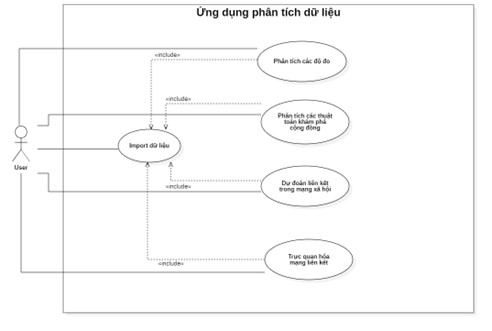
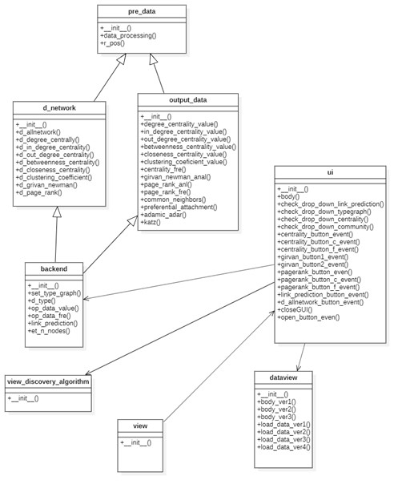
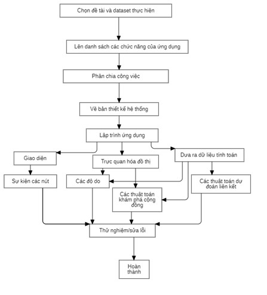
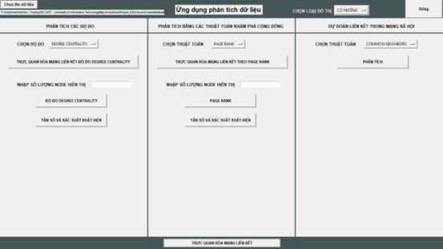
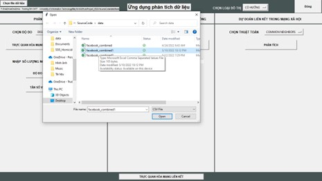
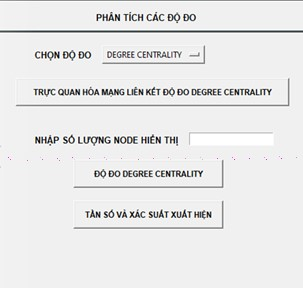
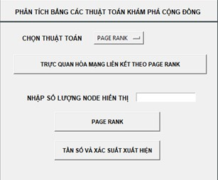
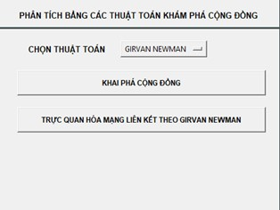
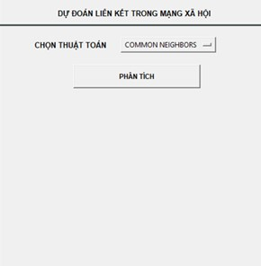

# Tổng quan

+ Đề tài của đồ án là xây dựng ứng dụng phân tích mạng xã hội là quá trình điều tra các cấu trúc của mạng xã hội thông qua danh sách mạng lưới liên kết (bạn bè) nhằm mục đích phân tích vai trò, phân loại các nút trong mạng xã hội, phát hiện cộng đồng trong mạng xã hội và dự đoán các liêt kết mới của các nút trong mạng xã hội
+ Việc thực hiện đề tài gồm các quá trình sau : Tìm bộ dữ liệu để phân tích → Lên danh sách các chức năng cần thực hiện→Tìm hiểu các thư viện cần sử dụng để thực hiện đề tài → Phân tích thiết kế hệ thống qua : Class Diagram và Use Case Diagram bằng StarUML →Tiến hành lập trình và hoàn thiện ứng dụng.

# Quy trình áp dụng xây dựng hệ thống
## Mô tả dataset 
+ Tập dữ liệu này bao gồm danh sách kết nối (‘Bạn bè’) giữa những người với nhau từ Facebook. Dữ liệu được thu thập từ những người tham gia khảo sát sử dụng ứng dụng Facebook bởi Stanford University (https://snap.stanford.edu/) trích dẫn từ : J. McAuley and J. Leskovec. Learning to Discover Social Circles in Ego Networks. NIPS, 2012.
+ Tập dữ liệu này có 2 cột không có tiêu đề : Cột 1 (Node thứ nhât), Cột 2 (Node thứ hai có liên kết là bạn bè với Node thứ nhất)
+ Link: https://snap.stanford.edu/data/facebook_combined.txt.gz, trong quá trình thực hiện đề tài nhóm đã đổi kiểu dữ liệu file từ *txt sang *csv để dễ sử dụng.
## Thư viện và công cụ sử dụng
+	Tkinter : là thư viện GUI tiêu chuẩn cho python.
+	pandas : là một thư viện mã nguồn mở, hỗ trợ đắc lực trong thao tác dữ liệu
+	networkx : là một module của python, hỗ trợ khả năng vẽ đồ thị, thao tác với dữ liệu, và đọc đồ thị đa cấp.
+	matplotlib : là một thư viện sử dụng để vẽ các đồ thị trong Python.
+	numpy : là thư viện lõi phục vụ cho khoa học máy tính của Python.
+	pyvis : là một thư viện Python cho phép tạo đồ thị mạng tương tác trong một vài dòng mã.
+	StarUML : là công cụ để phân tích thiết kế hệ thống theo OOP
## Phân tích thiết kế hệ thống
### Use Case Diagram

−	Mô tả : Người dùng muốn sử dụng các chức năng của ứng dụng đầu tiên phải import vào file dữ liệu sau đó có thể chọn các nhóm chức năng để sử dụng bao gồm :
+ Phân tích các độ đo : Degree Centrality(In, Out), Betweenness Centrality, Closeness Centrality, Clustering Coefficient.
+ Phân tích bằng các thuật toán khám phá cộng đồng: Girvan NewMan, Page Rank
+ Dự đoán liên kết trong mạng xã hội: CommonNeighbors, Adamic/Adar, Katz, Preferential Attachment
### Class Diagram 

−	Mô tả : 
+ pre_data (class) : thực hiện việc tiền xử lí dữ liệu (tạo graph, node …).
+ d_network (class) : thực hiện các hàm trực quan hóa đồ thị.
+ output_data (class) : thực hiện việc xử lí và trả về dữ liệu.
+ backend (class) : điều hướng các sự kiện từ ui (class).
+ dataview (class) : trực quan hóa các kiểu hiển thị dữ liệu.
+ view_discovery_algorithm (class) : trực quan hóa thuật toán girvan newman
+ view (class) : tạo đối tượng để chạy chương trình

## Quy trình thực hiện

# Đánh giá kết quả

## Import và xử lí dữ liệu đầu vào
+ Đã hoàn thành được việc import và xử lí file *csv đầu vào tạo graph, các biến dữ liệu để lưu kết quả để thực hiện các công việc tính toán.
+ Xử lí thêm được việc import file từ máy tính mà không cần cố dịnh đường dẫn file gốc. 

## Cụm chức năng phân tích các độ đo

- Các chức năng : 
+ Chọn độ đo : Chọn độ đo để phân tích.
+	Trực quan hóa mạng liên kết : Hiển thị đồ thị theo giá trị độ do đã chọn.
+	Độ đo : Tính toán giá trị độ đo theo độ đo đã chọn và hiển thi ra danh sách theo số lượng node đã chọn.
+	Tần số và xác suất xuất hiện : Hiển thị danh sách các giá trị độ đo đã chọn của đồ thị và tần số, xác suất xuất hiện của giá trị đó.

## Cụm chức năng phân tích bằng các thuật toán khám phá cộng đồng 
### Thuật toán Page Rank

−	Các chức năng : 
+	Trực quan hóa mạng liên kết : Hiển thị đồ thị theo giá trị Page Rank
+	Độ do : Tính toán giá trị Page Rank và hiển thi ra danh sách theo số lượng node đã chọn.
+ Tần số và xác suất xuất hiện : Hiển thị danh sách các giá trị Page Rank của đồ thị và tần số, xác suất xuất hiện của giá trị đó.

### Thuật toán Girvan NewMan

−	Các chức năng:
+ Khai phá cộng đồng : Tìm ra những cộng đồng có liên kết chặt chẽ.
+ Trực quan hóa mạng liên kết : Hiển thị đồ thị theo các cộng đồng đã tách được.

## Cụm chức năng dự đoán liên kết trong mạng xã hội

−	Các chức năng :
+ Chọn thuật toán: Chọn loại thuật toán dùng để phân tích.
+ Phân tích : Phân tích và đưa ra thứ tự các node có thể xuất hiện liên kết dựa theo thuật toán đã chọn.

